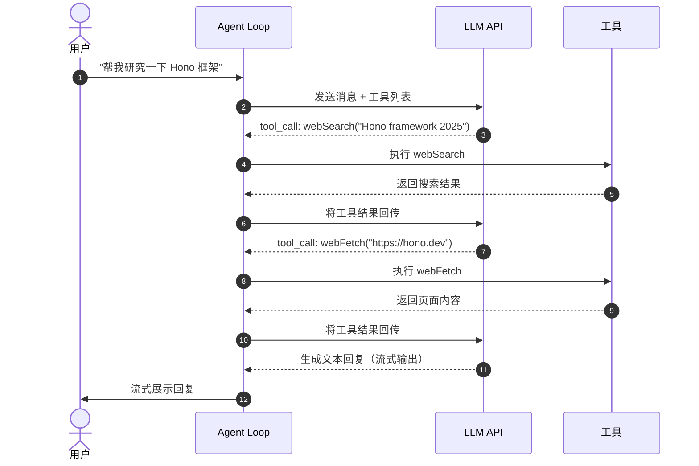
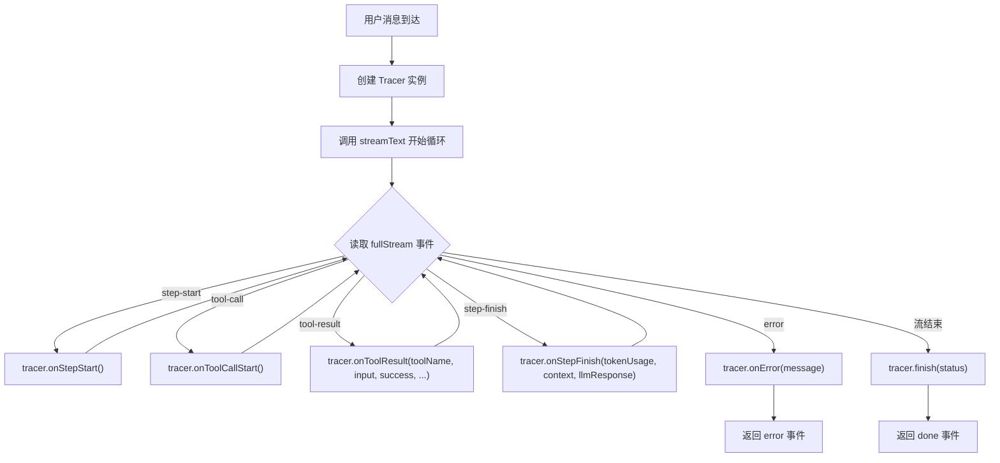
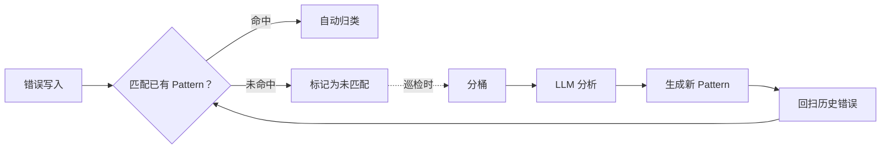
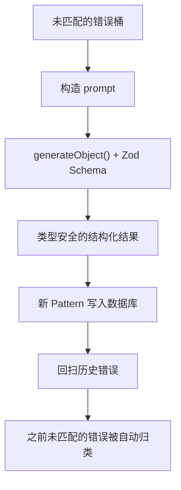
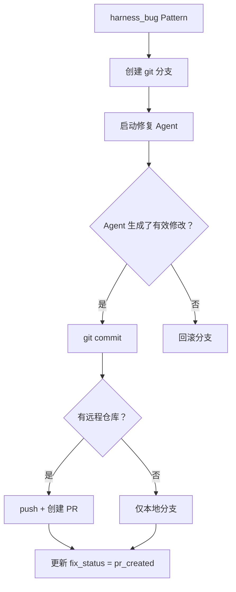
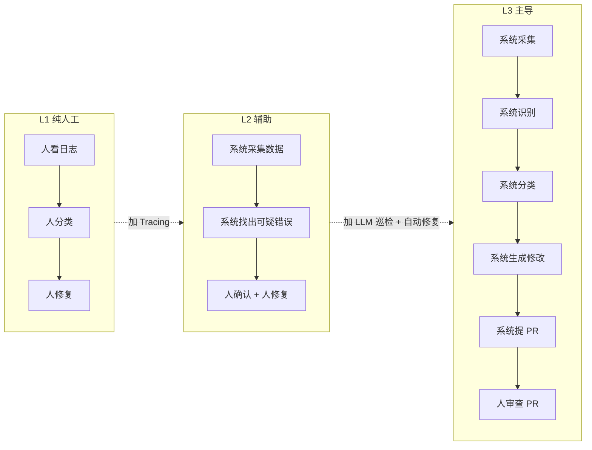
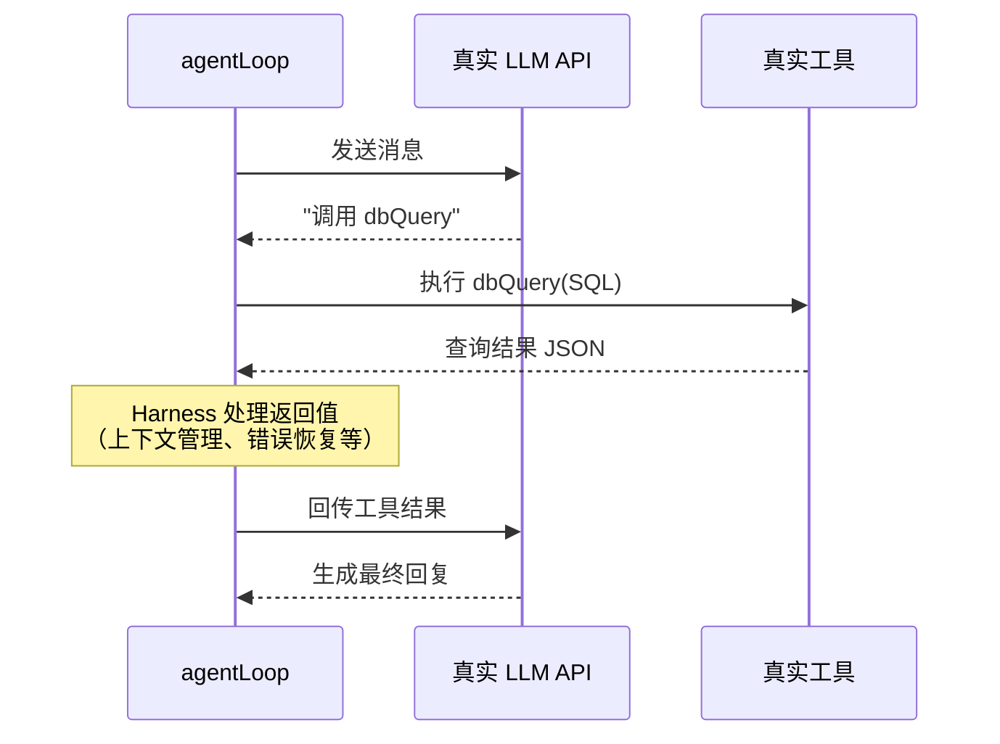
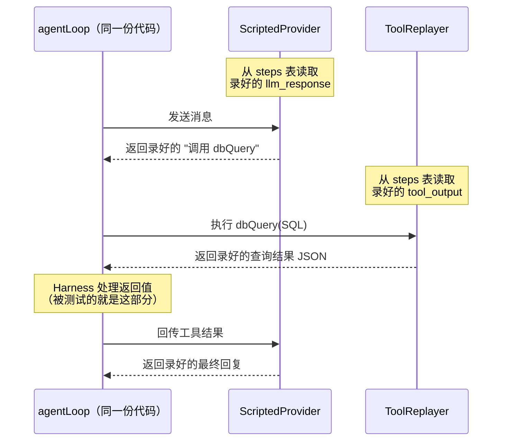
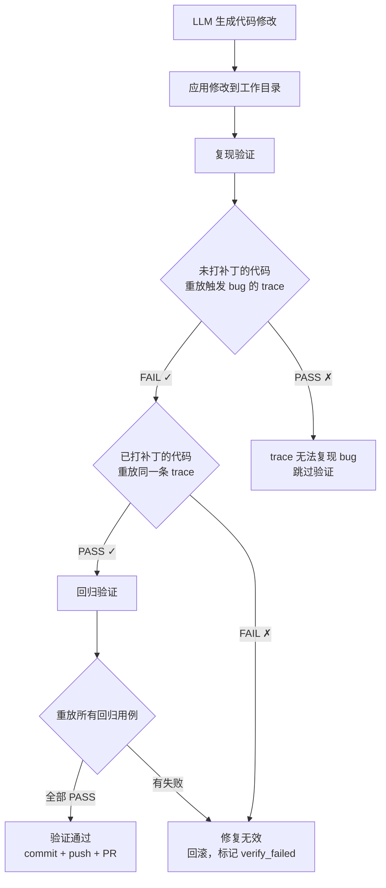

# 让 AI Agent 系统自己发现 bug、自己提修复 PR：自我进化的 Harness

本文介绍怎么让 AI Agent 的工程代码（Harness）具备自我进化能力——自动记录运行数据、自动识别错误模式、自动生成修复 PR（Pull Request，合并请求）。内容覆盖监控、错误模式识别、自动修复、行为分析和生产落地方案，每一章都会配合 demo 项目 [evo-agent-demo](https://github.com/woai3c/evo-agent-demo) 的代码和运行结果来讲解。


## 从一个 bug 说起

假设你做了一个 AI Agent 产品，它可以搜索资料、查数据库、执行代码。上线前也在内部进行了反复测试，并且没发现什么问题，于是就正式上线了。

但产品上线一段时间后，开始陆续的收到用户反馈，产品产生了各种各样的错误。因为内部测试覆盖不到所有的使用场景，而真实用户的数量远超团队测试人员，并且他们的提问方式、使用习惯、边界操作远远超出了测试用例的范围，导致出现了很多意料之外的情况。比如客服收到投诉说“问了个问题，AI 直接报错了”，技术论坛上有人发帖说多轮对话后程序崩了，运营那边也反馈搜索功能时好时坏。

这种靠用户反馈发现问题的方式很被动——等用户反馈时，往往已经有很多用户受到了影响。对开发来说更麻烦的是：光凭一句反馈很难定位到 bug 的真正原因，因为手上没有出问题时的执行上下文。

大多数 AI Agent 产品的 bug 基本上都出现在包裹模型的那层工程代码上，这层代码有一个专门的名字：**Harness**。Harness（意思是马具、马鞍） 就是驱动模型运转的工程系统。打个比方：模型是 CPU，Harness 是操作系统——操作系统管理进程调度和内存分配，Harness 管理工具调用、上下文窗口和错误恢复。

### 从被动到主动

既然问题出在 Harness 上，那么我们得知道 Harness 每次执行的时候到底发生了什么。我们可以给 Agent 加一层 Tracing，这相当于给 Agent 装上行车记录仪。Agent 每次执行的时候，调用了什么工具、传的参数是什么、响应结果是什么等等，都会记到数据库里。这样就不用等用户来反馈，我们自己查数据库就能看到哪些请求出了问题。

但每天产生的请求这么多，可能有几千上万条，其中的错误也不少，依赖人工逐条查看不太现实。所以还需要让系统自动按类型把错误分组（比如所有 429 限流错误归到一组），然后判断每一类错误是用户的问题/供应商的问题、还是 Harness 自身的 bug——如果是 Harness 的 bug，需要让 LLM 根据错误原因去分析相关的源码并且生成修复代码，最后提交 PR 来修复这个问题。本文后面的内容将按这个顺序来展开，并配以 evo-agent-demo 的代码和运行结果来讲解。

### demo 快速体验

我们先运行一次 evo-agent-demo 来看看效果，后面会逐步拆解每个环节的实现：

```bash
git clone https://github.com/woai3c/evo-agent-demo
cd evo-agent-demo && pnpm install
cp .env.example .env          # 填入至少一个 LLM API Key
pnpm db:seed                  # 填充演示数据
pnpm simulate --mock          # 模拟 100 条用户请求（含各种错误，不调 API）
pnpm dev                      # 启动前后端开发服务器
```

项目启动后，打开 `http://localhost:5173/admin/inspections` 页面，点击“巡检：识别 Pattern”按钮，即可观察到日志面板实时输出巡检进度。巡检完成后可以切换到概览页查看各项指标的变化。

> **📸 图 1（截图）**：管理面板概览页（Dashboard），展示成功率、Pattern 覆盖率等核心指标。让读者第一时间看到产品的最终形态。

## 快速了解 AI Agent Harness 工程全貌

> 已有 AI Agent 开发经验的读者可以跳过本节，直接从“Tracing”开始。

这一节将介绍一个 Agent 产品由哪些部件组成、各自负责什么，让还没接触过 AI Agent 开发的读者先有个整体概念。

### 什么是 AI Agent

简单来说，AI Agent 就是能调用工具执行任务的 LLM 应用。普通聊天机器人只能回复文本，但 Agent 还可以执行搜索、查询数据库、修改代码等任务。聊天机器人的流程是“用户说话 → 模型回复 → 结束”，Agent 则是“用户说话 → 模型决定调什么工具 → 拿到结果 → 继续思考 → 可能再调工具 → … → 最终回复用户”。这个循环过程叫 **Agent Loop**。

用本文的 demo（代号 Evo）举个例子。用户问“帮我研究一下 Hono 框架”，Agent 会先调用 `webSearch` 工具搜索资料，然后从结果里选几个 URL，再调用 `webFetch` 工具抓取页面内容，最后再综合信息写一份总结。整个过程中模型自主决定工具的选择和调用顺序，不需要人工干预。

> **🎬 图 2（GIF 动图）**：在聊天界面录一段 Agent 完整交互过程——用户输入“帮我研究一下 Hono 框架”→ Agent 流式输出 → 调用 webSearch → 工具调用卡片展开 → 调用 webFetch → 综合回复。

用时序图拆解一下内部流程：



> 图 3 Agent Loop 一次完整执行的时序

Agent Loop 就是用户、模型和工具之间的调度中枢。用户的消息交给模型，模型决定调用什么工具，Agent Loop 执行工具并把结果交回给模型，模型再决定下一步是继续调用工具还是直接回复用户。这个循环可能转一次，也可能转十次，取决于任务的复杂度。

### Agent 的核心组成

一个 Agent 产品大概由这几个部分组成：

```
┌─────────────────────────────────────┐
│              Harness                │
│                                     │
│  ┌───────────┐  ┌───────────────┐  │
│  │ Agent Loop│  │ 工具系统       │  │
│  │ (调度器)  │  │ (搜索/数据库/ │  │
│  │           │  │  代码执行/...) │  │
│  └─────┬─────┘  └───────┬───────┘  │
│        │                │          │
│  ┌─────┴────────────────┴───────┐  │
│  │     上下文管理 (记忆)         │  │
│  └──────────────────────────────┘  │
│                                     │
│  ┌──────────────────────────────┐  │
│  │     Tracing (行车记录仪)     │  │
│  └──────────────────────────────┘  │
│                                     │
│  ┌──────────────────────────────┐  │
│  │     进化引擎 (自我完善)      │  │
│  └──────────────────────────────┘  │
└─────────────────────────────────────┘
         ↕
    ┌─────────┐
    │   LLM   │  ← 可替换（DeepSeek / OpenAI / Anthropic / ...）
    └─────────┘
```

**Harness** 就是包裹模型的所有工程代码。模型提供推理能力，Harness 负责把这种能力变成一个能用的产品。

Agent Loop 是调度器，驱动“问模型 → 调用工具 → 再问模型”的循环。demo 里这个循环的入口是 `agentLoop()` 函数（`packages/server/src/agent/loop.ts`），通过 Vercel AI SDK 向模型发送流式请求，逐步消费模型返回的事件。模型要求调用工具时，SDK 自动执行对应的工具并把结果传回。同时为了防止无限循环，在本 demo 里单次对话最多执行 15 步（生产环境里远远不止 15 轮）。

工具系统定义了 Agent 能做什么。在 Evo demo 里有 6 个工具：网络搜索、抓取网页、读取文件、执行代码、查询数据库、发送邮件。每个工具由三部分组成：一段给模型看的自然语言描述（模型根据描述决定要不要调这个工具），一组用 Zod Schema 定义的参数格式，以及一个实际执行操作的函数。

上下文管理解决的是 token 限制问题。Agent 每调用一次工具，工具的输入和输出都要放进对话历史发给模型。10 轮对话加几次网页搜索，上下文窗口（Context Window）可能就快满了。demo 里用两个办法应对：消息压缩（`packages/server/src/context/compression.ts`）——对话历史的 token 数超过窗口容量的 70% 时，自动把老消息压缩成摘要；工具结果截断（`packages/server/src/context/truncation.ts`）——搜索返回的网页可能有几十 KB，只保留前 30,000 字符加尾部片段。

Tracing 记录每一步的执行数据——调用了什么工具、花了多少 token、耗时多久、成功没有。这些数据是后面所有分析的基础，下一节详细讲。

进化引擎从 Tracing 数据里自动发现错误、分类原因、生成修复代码。后面会分别讲它的三个部分：错误 Pattern（模式） 识别、自动修复、行为分析。

### demo 项目速览

Evo 是一个 pnpm monorepo（单仓多包），包含三个包：

- `packages/shared`（`@evo/shared`）——TypeScript 类型和常量，被 server 和 web 共同引用
- `packages/server`（`@evo/server`）——Hono + Node.js 后端，包含 Agent Loop、工具系统、Tracing、进化引擎、REST API
- `packages/web`（`@evo/web`）——Vite + React 19 + Tailwind + shadcn/ui 前端，包含聊天界面和管理后台

数据库用 better-sqlite3，LLM 接入用 Vercel AI SDK，支持 DeepSeek、OpenAI、Anthropic、阿里百炼、智谱、Moonshot 六家供应商，默认使用 DeepSeek。

关键代码位置：`packages/server/src/agent/loop.ts` 是 Agent Loop 的入口，`packages/server/src/evolution/` 是进化引擎的全部实现。读者在阅读后续内容时，可以对照这些文件查看完整代码。

#### demo 与生产环境的差异

demo 做了不少简化，和生产环境的主要差异：

| 维度 | demo 实现 | 生产环境替代方案 |
|------|-----------|------------------|
| 巡检触发 | 管理后台手动点击“开始巡检” | 定时任务（每 1-2 小时），分析上一周期的新增错误 |
| 自动修复触发 | 管理后台手动点击“自动修复” | 定时任务（每天凌晨），对未修复的 harness_bug 生成 PR |
| 数据库 | SQLite 单文件，适合本地开发 | PostgreSQL / MySQL，支持并发和多实例 |
| 模拟数据 | `pnpm simulate --mock` 批量注入 | 真实用户流量产生的 trace 数据 |
| 错误注入 | `simulate-errors.ts` 随机注入错误 | 生产环境中自然发生的错误 |
| PR 提交 | 提交到本地 Git 仓库 | 通过 GitHub/GitLab API 提交到代码仓库，走 CI/CD（持续集成/持续部署）流程 |

demo 里所有操作都是手动触发的——点击按钮执行一次巡检、点击按钮生成修复 PR。这是为了让你能一步步看到每个环节的输入和输出。生产环境中这些操作应该由定时任务自动执行，调用的函数和 demo 里手动触发的是同一个。

## Tracing：给 Agent 装上“行车记录仪”

行车记录仪的作用是出了事故看录像，没出事也能复盘驾驶习惯——Tracing 在 Agent 系统里的作用差不多。不过和普通日志不同，Tracing 记录的是结构化的数据，而且这些数据会被后面的自动分析程序持续消费，不只是出问题了才翻看。

### Trace 数据结构

举个例子。demo 内置了一个音乐库作为示例数据，假设用户问“哪个歌手专辑最多”，Tracing 会把 Agent 的整个执行过程记录下来：

```
Operation: op_abc123
  ├─ Step 0: call_llm  → 模型决定调 dbQuery     (耗时 800ms, tokens: 1200)
  ├─ Step 1: call_tool → dbQuery 执行 SQL        (耗时 50ms, 成功)
  ├─ Step 2: call_llm  → 模型根据查询结果组织回答 (耗时 600ms, tokens: 900)
  └─ 结果: success, 总耗时 1450ms
```

整个过程被拆成一个 Operation（操作）和若干 Step（步骤）。Operation 对应一次完整的用户请求，记录总耗时、token 用量、最终状态这些汇总信息。每个 Step 对应 Agent Loop 里的一次 LLM 调用或一次工具调用。

每个 Step 记录以下字段：

| 字段 | 说明 |
|------|------|
| `type` | 步骤类型：`call_llm`（调用模型）或 `call_tool`（调用工具） |
| `duration_ms` | 这一步的耗时（毫秒） |
| `tokens` | 消耗的 token 数（仅 `call_llm` 步骤），包含 input、output、cached 三个分量 |
| `tool_name` | 调用的工具名称（仅 `call_tool` 步骤） |
| `tool_success` | 工具调用是否成功（布尔值） |
| `tool_input` | 工具调用的输入参数 |
| `tool_output` | 工具返回的完整结果 |
| `error` | 如果出错，错误的详细信息 |
| `llm_response` | 模型的完整文本回复（仅 `call_llm` 步骤） |

`tool_input` 和 `tool_output` 保留了工具调用的完整上下文，管理面板里可以查看每一步的输入输出，方便排查问题。`llm_response` 保留了模型回复，后续重放引擎需要这些数据来复现执行过程。

> **🎬 图 4（GIF 动图）**：在 Trace 浏览器页面（`/admin/traces`）录一段交互——点击一条 operation → 步骤时间线展开 → 点击某个 step → 下方显示完整的 LLM 回复和工具返回。

### Tracing 的接入方式

> 源码：`packages/server/src/agent/loop.ts`

demo 里 Agent Loop 每执行完一步就记录一条 trace 数据：工具调用完成后，执行一次 `tracer.onToolResult()` 记录调用结果；LLM 回复完成后，执行 `tracer.onStepFinish()` 记录 token 用量。这样执行代码和记录代码始终成对出现，不会出现某一步执行了但漏掉记录的情况。

trace 调用在 Agent Loop 中的位置：



> 图 5 Agent Loop 内的 trace 写入点

简化后的代码（完整实现见源码）：

```typescript
export async function* agentLoop(params: AgentLoopParams): AsyncGenerator<StreamEvent> {
  const tracer = new Tracer({ userId, conversationId, provider, model: modelId })

  const result = streamText({ model: llmModel, system: SYSTEM_PROMPT, messages, tools, maxSteps: 15 })

  for await (const part of result.fullStream) {
    switch (part.type) {
      case 'step-start':
        tracer.onStepStart()
        break
      case 'tool-call':
        tracer.onToolCallStart()
        yield { type: 'tool-call', toolName: part.toolName, input: part.args }
        break
      case 'tool-result':
        tracer.onToolResult(part.toolName, toolInput, success, outputSize, resultObj, errorMsg)
        yield { type: 'tool-result', toolName: part.toolName, success, outputSize }
        break
      case 'step-finish':
        tracer.onStepFinish(tokenUsage, contextInfo, stepText)
        break
      case 'error':
        tracer.onError(String(part.error))
        yield { type: 'error', message: String(part.error) }
        break
    }
  }

  const operationId = tracer.finish(status)
  yield { type: 'done', operationId }
}
```

每个 `case` 分支里都有一行 `tracer.onXxx()` 调用。Tracer 在函数入口创建，在出口 `finish()`。Agent Loop 跑了多少步，trace 就记了多少步。

demo 里的 Tracer 是自己实现的，因为后面的进化引擎需要用 SQL 查询 trace 数据（分桶、匹配、回扫）。如果你的产品已经接入了 Sentry、PostHog 等平台，可以在 Agent Loop 的相同位置用这些平台的 API 做手动埋点，记录的数据字段跟上面表格里的一样。但埋点数据最终要同步到自己的数据库里，或者通过平台 API 导出，因为进化引擎需要直接查询这些数据。

### 两个设计要点：即时写入与 token 记录

即时写入。Agent 每执行完一步，Tracer 立刻把这一步的数据写入 SQLite，不在内存中缓存。因为崩溃时的数据是最有价值的，假设 Agent 在第 5 步执行崩溃，但前 4 步的记录已经在数据库里了，所以分析崩溃原因时有上下文可查。如果缓存在内存中批量写入，程序崩溃整条 trace 数据就丢了。demo 里 `Tracer` 的每个 `onXxx()` 方法都会立刻调用 `traceStore.insertStep()` 写入数据库。SQLite 开启 WAL（Write-Ahead Logging）模式后，每步写一次不会有性能问题。

token 记录。Tracer 在每个 `step-finish` 事件里记录 `promptTokens`、`completionTokens` 和缓存命中数（不同供应商字段名不一样——DeepSeek 叫 `promptCacheHitTokens`，Anthropic 叫 `cacheReadInputTokens`，OpenAI 叫 `cachedPromptTokens`）。Operation 结束时 `Tracer.finish()` 汇总所有 step 的 token 用量。后面行为分析会用到这些数据，比如发现“某类操作的 token 消耗是其他操作的 10 倍”。

## 错误 Pattern 自动识别

Trace 能告诉我们“出了什么错”，但不能告诉我们“该怎么处理”。这一节讲系统怎么自动把错误分类，以及分类规则（Pattern）是怎么生成的。



> 图 6 错误处理全景：实时匹配（实线）+ 定期巡检（虚线）

### Trace 里的错误记录

Trace 记录的每条错误包含供应商、错误类型、HTTP 状态码、工具名、错误消息这几个字段。下面是几种典型错误：

搜索 API 限流：
```
provider=deepseek, error_type=rate_limit, status_code=429, tool_name=null
message: "429 Too Many Requests"
```

SQL 查询了不存在的表：
```
provider=null, error_type=tool_error, status_code=null, tool_name=dbQuery
message: "no such table: orders"
```

模型返回了无法解析的 JSON：
```
provider=openai, error_type=invalid_json, status_code=null, tool_name=null
message: "Unexpected token at position 1234"
```

上下文超出 token 限制：
```
provider=deepseek, error_type=context_overflow, status_code=400, tool_name=null
message: "This model's maximum context length is 65536 tokens"
```

这些错误数据都带着供应商、类型、状态码这些字段，但字段本身只描述了“发生了什么”，没有回答“该怎么处理”。所以我们需要一条规则来判断：这种错误属于哪个类别？这就是 Pattern 的作用。

> **📸 图 7（截图）**：管理面板错误分析页面（`/admin/errors`），展示按供应商 × 错误类型分桶后的可视化。

### Pattern：错误的分类规则

> 源码：`packages/server/src/evolution/pattern-matcher.ts`

Pattern 是存在数据库里的一条错误分类规则。每条 Pattern 由三部分组成：名称、匹配条件（哪些字段要满足什么值）、分类（这种错误属于哪个类别）。当一条错误的字段和某个 Pattern 的匹配条件吻合时，系统就知道这条错误属于哪一类，不需要人工判断。比如：

```
Pattern 示例：
  名称：deepseek-rate-limit-429
  分类：provider_error（供应商的问题，不是 Harness 能修的）
  匹配规则：provider = deepseek AND statusCode = 429
```

不同的错误分类对应四种处理方式：`user_error`（用户的问题，比如 API Key 过期）不用改代码；`provider_error`（供应商的问题，比如限流）不用改代码，但可能要加重试；`harness_bug`（我们自己的 bug）需要修代码——后面“自动修复”那节处理的就是这一类；`ignore`（管理员认为不需要处理的）直接跳过，自动修复时也会忽略。

每条错误写入数据库时，系统会调 `matchError()` 尝试匹配现有 Pattern——逐一对比 provider、errorType、statusCode、toolName 是否符合条件，最后用正则检查错误消息，全部匹配上才算命中。匹配不上的错误留在那里，等下一轮巡检时被分桶、交给 LLM 分析、生成新 Pattern。

```typescript
export function matchError(error: ErrorToMatch): Pattern | null {
  const patterns = loadPatterns()
  for (const pattern of patterns) {
    const rule = pattern.matchRule
    if (rule.provider && rule.provider !== '*' && rule.provider !== error.provider) continue
    if (rule.errorType && rule.errorType !== error.errorType) continue
    if (rule.statusCode != null && rule.statusCode !== error.statusCode) continue
    if (rule.toolName && rule.toolName !== error.toolName) continue
    if (rule.messageRegex) {
      if (!new RegExp(rule.messageRegex, 'i').test(error.message)) continue
    }
    // 命中：更新计数
    return pattern
  }
  return null
}
```

> **📸 图 8（截图）**：管理面板 Pattern 库页面（`/admin/patterns`），展示已发现的 Pattern 列表。每条 Pattern 显示名称、分类 badge、匹配规则、命中次数、fix_status。

### LLM 巡检：生成新 Pattern

> 源码：`packages/server/src/evolution/error-bucketer.ts`、`packages/server/src/evolution/inspector.ts`

上一节说到，匹配不上的错误会留在那里等巡检处理。系统刚上线时 Pattern 库是空的，所有的错误都是未匹配的。巡检就是用 LLM 来分析这些错误、生成新 Pattern 的过程。

#### 分桶

LLM 不需要逐条看错误。同一种错误出现 15 次和出现 1 次，根因都是一样的。所以巡检先把未匹配的错误按类型归组——`bucketErrors()` 按供应商、错误类型、HTTP 状态码、工具名、错误消息五个维度做 GROUP BY 分组，并返回每个桶的错误条数：

```typescript
const rows = db.prepare(
  `SELECT e.provider, e.error_type, e.status_code, e.tool_name, e.message, COUNT(*) as count
   FROM errors e ${where}
   GROUP BY e.provider, e.error_type, e.status_code, e.tool_name, e.message
   ORDER BY count DESC`
).all(...params)
```

分桶结果示例：

| 桶 | 数量 |
|---|---|
| deepseek × rate_limit × 429 × null | 15 |
| null × tool_error × null × dbQuery | 8 |
| openai × invalid_json × null × null | 3 |

比如表里的 15 条 deepseek 限流错误，分桶后就是一个桶，LLM 只需要分析一次。`bucketErrors()` 的 `unmatched` 参数只返回还没被 Pattern 覆盖的错误桶，已经有 Pattern 的不需要再分析。

#### LLM 分析

分桶之后，系统把未匹配的错误桶的汇总信息——供应商、错误类型、状态码、工具名、错误消息、出现次数——发给 LLM，让它判断每个桶的根因并生成对应的 Pattern。

LLM 返回的结果要直接写入数据库，所以格式不能随意。这里用 Zod 定义一个 Schema，通过 Vercel AI SDK 的 `generateObject` 传给模型，模型必须按这个结构返回 JSON，格式不对时 SDK 会自动重试：

```typescript
const PatternSuggestionSchema = z.object({
  patterns: z.array(z.object({
    name: z.string().describe('Human-readable pattern name, e.g. deepseek-rate-limit-429'),
    category: z.enum(['user_error', 'provider_error', 'harness_bug', 'ignore']),
    errorType: z.string(),
    matchRule: z.object({
      statusCode: z.number().nullable().optional(),
      provider: z.string().optional(),
      toolName: z.string().nullable().optional(),
      messageRegex: z.string().optional(),
    }),
    reasoning: z.string().describe('Why you classified it this way'),
  })),
  bugs: z.array(z.object({
    title: z.string(),
    description: z.string(),
    rootCause: z.string(),
    suggestedFix: z.string(),
    severity: z.enum(['low', 'medium', 'high']),
  })),
  summary: z.string(),
})

const result = await generateObject({
  model,
  schema: PatternSuggestionSchema,
  prompt,  // 包含未匹配错误桶的详细信息
  abortSignal: AbortSignal.timeout(120_000),
})
```
上面代码中的 `patterns` 字段是 LLM 为每个错误桶生成的 Pattern——名称、分类、匹配规则和分类理由。而 `bugs` 字段是 `harness_bug` 的详细分析：根因、修复建议、严重程度——后面“自动修复”那节会用到这些信息。`summary` 字段是本轮巡检的总结。

LLM 返回结果后，`applyFixes()` 把新 Pattern 写入数据库，并立刻回扫（Backfill）所有历史错误——找到所有 `pattern_id` 为空的记录，用新 Pattern 逐一对比，能匹配上的就标记。之前没被识别的错误，现在有了 Pattern 之后就自动归类了。



> 图 9 LLM 巡检的内部数据流

> **🎬 图 10（GIF 动图）**：巡检的执行过程录屏（`/admin/inspections`）——点击“巡检：识别 Pattern”按钮 → 日志面板实时滚动 → “Phase 1: LLM 分析中……” → “识别到 X 个 Pattern” → 巡检完成。

读者可以用 demo 自己验证。执行 `pnpm simulate --mock` 注入模拟请求后，在管理面板里手动执行一次巡检。巡检会取出所有未匹配的错误桶，LLM 为每个桶生成 Pattern，然后用新 Pattern 回扫历史错误。巡检执行完毕后，之前积累的未匹配错误基本都能被覆盖。

> **📸 图 11（截图）**：管理面板进化趋势页面（`/admin/trends`），展示未匹配错误比例随时间下降的折线图、累计 Pattern 增长后趋于平台的曲线、巡检 Before/After 对比表。

## 自动修复：让系统自己提 PR

上一节识别出了 `harness_bug`。这一节让系统自动生成修复代码、提交 PR。从定位文件到创建 PR，中间不需要开发者参与，但合并 PR 还是要开发者审核。

### 修复流程

> 源码：`packages/server/src/evolution/auto-pr.ts`

自动修复用的是和聊天一样的 Agent Loop 架构——LLM 通过工具自主搜索文件、读取代码、修改代码。



> 图 12 自动修复流程

上一节的巡检会把 Harness 自身的 bug 标记为 `harness_bug` Pattern，并将状态更新为 `fix_status = 'unfixed'`。自动修复会逐个处理这些未修复的 Pattern，为每个 Pattern 生成修复代码并提交 PR。除了 `harness_bug`，被标为 `critical` 的不健康行为（下一节讲）也会一并处理。bug 修复的分支用 `fix/` 前缀，行为优化用 `improve/`。

对每个待修复目标，系统先创建一个 git 分支，然后启动一个修复 Agent。这个 Agent 配备了文件搜索（`glob`、`grep`）、读写（`readFile`、`editFile`、`writeFile`）和提交（`submitFix`）等工具。Agent 拿到错误信息后，自己搜索相关文件、读取代码、定位问题、应用修改——和聊天 Agent 一样，都是 LLM 通过工具自主完成的。

Agent 完成修改后，系统会提交所有修改过的文件。如果已经有远程仓库，会自动 push 并创建 PR；否则只在本地建分支。最后更新 `fix_status` 状态为 `pr_created`。

> **🎬 图 13（GIF 动图）**：自动修复的执行过程录屏（`/admin/inspections`）——切换到“自动修复”标签页 → 点击“自动修复”按钮 → 日志面板实时输出“定位文件…… 生成修改…… 创建分支…… 提交 PR……” → 修复完成。

> **📸 图 14（截图）**：GitHub PR 页面——系统自动创建的 Pull Request，标题、描述、代码 diff。

> **📸 图 15（截图）**：管理面板 Pattern 库页面，一条 harness_bug Pattern 的 fix_status = pr_created，旁边显示 PR 链接。

### 安全边界：为什么不让它自己合并代码

自动修复只生成 PR，合并仍然需要开发者审核。LLM 生成的代码可能引入新的问题，在没有自动化测试覆盖修改行为的情况下，让系统自己合并代码风险太大。如果想跳过开发者审核，至少需要两样东西：一套覆盖了修改行为的自动化测试，以及一个能复现触发 bug 的操作的重放引擎。后面“落地指南”那节会讲重放引擎的设计。
## 行为分析：没报错 ≠ 没问题

前面几节解决的都是“出了什么错”。这一节看另一类问题——“没报错，但不太对劲”。

### 错误模式 vs 行为模式

前面几节分析的是实际报错的记录——错误 Pattern。行为分析的对象不同，它看所有操作，包括成功的。两者的区别：

|                  | 错误模式                       | 行为模式                         |
| ---------------- | ---------------------------------------- | ---------------------------------------- |
| 分析对象     | 实际报错的记录                           | 所有操作，包括成功的                     |
| 发现什么     | 系统崩溃或异常                               | 没崩但效率低、质量差                       |
| 举例         | 搜索 API 429 限流、SQL 语法错误          | 简单问题调用了 8 次工具、搜索类操作 token 消耗过高 |
| 分类方式     | 四个固定类别（user_error / provider_error / harness_bug / ignore） | LLM 按用户意图动态分组 |
| 最终动作     | harness_bug → 自动生成修复 PR            | 生成改进建议，严重的也自动生成修复 PR           |

### 什么算“不健康”

用户问了个简单问题（“介绍一下你自己”），Agent 却调用了 3 次工具、花了 15 秒才回答。状态是“成功”，但效率明显不对。可能是 system prompt 对工具使用的引导不够精确，不需要工具的时候也去搜索了。

数据库查询类操作的成功率只有 65%。Agent 工具失败后会换种方式回答，所以不会报错，但三分之一的查询结果是不正确的。可能是 dbQuery 工具的 Schema 描述里缺少表结构信息，模型写出了错误的 SQL。

搜索研究类操作的平均 token 消耗是其他操作的 10 倍。要么是 webFetch 返回的页面没做截断，要么是 Agent 搜完之后抓了太多不相关的页面。

### 分析流程

> 源码：`packages/server/src/evolution/behavior-analyzer.ts`

要发现上面这类问题，需要先对操作数据做聚类分析。系统从数据库加载最近 100 条 operation（一条 operation 对应一次完整的用户请求，包含多个 step，前面 Tracing 章节介绍过）的摘要，把每条格式化成一行文本，全部拼进 prompt 发给 LLM：

```
[0] “帮我研究一下 Hono 框架” → tools: webSearch→webFetch→webFetch → success (5 steps, 12.3s)
[1] “哪个歌手专辑最多” → tools: dbQuery → success (3 steps, 2.1s)
[2] “总结一下这篇文章” → tools: webFetch → success (3 steps, 4.5s)
[3] “查一下销量前10的专辑” → tools: dbQuery → error (4 steps, 3.2s)
...
```

每行文本包含用户消息、工具调用链、状态、步数和耗时。LLM 根据用户意图和工具使用模式对这些 operation 做分组，并返回每组的名称、描述、代表性工具序列，以及属于该组的编号列表。比如上面的 `[0]` 和 `[2]` 都涉及网络搜索和内容抓取，会被归为“网络调研 + 总结”；`[1]` 和 `[3]` 都只用了 `dbQuery`，会被归为“数据库查询”。分组没有预定义的类别，LLM 根据实际数据自行决定。输出格式用 `generateObject` + Zod Schema 约束。

demo 里取 100 条是因为所有摘要要一次性放进 prompt，太多会超出上下文窗口。生产环境应该改成按时间窗口增量分析。为了避免重复分析，系统会记录上一轮的 operation 集合签名，没有新增 operation 就跳过。

分组之后是打分。不同类型的任务性能差异很大——涉及 `webSearch`/`webFetch` 的网络调研天然比本地的 `dbQuery` 慢得多，用同一套阈值对两者打分不合理。所以系统根据行为组的工具序列自动选择对应的阈值：

| 维度 | 轻量任务（本地工具） | 重度任务（含网络工具） |
|------|---------------------|----------------------|
| 单次平均耗时 | ≤ 15 秒 | ≤ 60 秒 |
| 单次平均步数 | ≤ 10 | ≤ 20 |
| 单次平均 token | ≤ 50k | ≤ 150k |

成功率（≥ 80%）和工具错误率（≤ 20%）不区分任务类型，这两个指标跟复杂度无关。每个维度 0.2 分，满分 1.0。

```typescript
const HEALTH_THRESHOLDS = {
  minSuccessRate: 0.8,
  maxToolErrorRate: 0.2,
  light: { maxAvgDuration: 15_000, maxAvgSteps: 10, maxAvgTokens: 50_000 },
  heavy: { maxAvgDuration: 60_000, maxAvgSteps: 20, maxAvgTokens: 150_000 },
}

const WEB_TOOLS = ['webSearch', 'webFetch']

function getThresholdTier(toolSequence: string) {
  return WEB_TOOLS.some(t => toolSequence.includes(t))
    ? HEALTH_THRESHOLDS.heavy : HEALTH_THRESHOLDS.light
}
```

判断逻辑很简单：看行为组的代表性工具序列里有没有网络工具，有的话用 `heavy` 标准，没有用 `light`。如果你的 Agent 有更多类型的工具，加新的分类就行。

一个行为组的健康得分低于 0.8（即至少两个维度未达标），或者触发了 `low_success_rate` 或 `high_tool_error_rate` 这两个关键标记，就被判定为”不健康”。

最后是生成建议。对得分低的组，再次调用 LLM，让它给出具体的 Harness 层改进建议。LLM 收到的信息包括行为名称、具体的健康指标数值、工具调用序列，以及哪些维度不达标。要求建议针对 Harness 代码本身（比如“给 webFetch 加重试”、“优化 dbQuery 的 Schema 描述”），而不是 prompt 层面的调整。

LLM 给出的每条建议会标注严重程度：`critical` 表示有明确的代码修改方案，可以直接进入自动修复流程；`suggestion` 表示建议性改进，由开发者决定是否实施。`critical` 级别的建议会被标记为 `fix_status = 'unfixed'`，后面会进入自动修复的处理队列。

> **📸 图 16（截图）**：管理面板行为分析页面（`/admin/behaviors`），展示 LLM 聚类出的行为模式列表——名称、操作次数、5 维得分、健康度、改进建议。

## 落地指南：从 demo 到生产，以及用重放引擎验证修复

前面几节把 demo 里的每个模块都讲了一遍。这一节聊怎么把这些东西迁移到真实产品里，以及当前最大的短板——怎么自动验证修复到底有没有用。

### 迁移到你的项目

虽然 demo 用的是 TypeScript + Node.js，但实现思路跟语言没有关系：

| 步骤 | 做什么 | 说明 |
| ---- | ------ | ---- |
| 1 | 在 Agent Loop 里加 Tracing | Agent 每执行完一步就立刻写入数据库。关键是即时写入——崩溃了也不会丢失已完成步骤的记录 |
| 2 | 错误分桶 | 按 provider × 错误类型 × 状态码 × 工具名 × 错误消息做 GROUP BY 分组，通过 SQL 可以看到出现次数最多的错误类型 |
| 3 | 定时 LLM 巡检 | 定时把未匹配的错误桶发给 LLM，通过 `generateObject` + Zod Schema（或对应语言的 JSON Schema 库）约束输出格式，自动生成新 Pattern |
| 4 | 自动回扫 | 新 Pattern 生成后立刻回扫历史错误，之前没匹配上的错误现在能被自动归类 |
| 5 | 自动修复 | 巡检识别出的 `harness_bug` 和行为分析标记为 `critical` 的问题，都会进入自动修复队列。修复时 Agent 会读取相关源码、生成修复代码、提交 PR |

最重要的是第 1 步。没有 trace 数据，后面什么都干不了。

### 调度策略

demo 里所有操作都要手动点按钮，生产环境应该配定时任务：

| 任务 | demo 中 | 生产环境建议 | 理由 |
| ---- | ------- | ------------ | ---- |
| 错误巡检（识别 Pattern） | 手动点击 | 每 1-2 小时自动执行 | 错误对用户体验影响大，需要快速发现。每次只分析上一个周期内新产生的未匹配错误 |
| 行为分析（健康度评估） | 手动点击 | 每 24 小时自动执行 | 行为模式是慢变量，需要积累足够多的新操作数据才有意义 |
| 自动修复（生成 PR） | 手动点击 | 每天凌晨固定时间执行一次 | 代码修改需要审慎，安排在低峰期执行 |

执行顺序有依赖：巡检先执行 → 行为分析再执行 → 最后自动修复处理所有待修的。实现方式不限，cron job、GitHub Actions、Temporal 都行，核心就是定时调用同样的函数。

### 成本参考

按生产环境估算：每小时巡检一次，每天行为分析和自动修复各一次。

| 任务 | 单轮 token 消耗 | 月度频次 | 月度 token |
| ---- | -------------- | ------- | --------- |
| 巡检 | ~1 万（错误桶摘要 + LLM 分析） | 24 次/天 × 30 天 = 720 次 | ~720 万 |
| 行为分析 | ~2 万（100 条 operation 摘要 + 聚类） | 1 次/天 × 30 天 = 30 次 | ~60 万 |
| 自动修复 | 20-100 万/目标（完整 Agent Loop，含多轮文件读取和代码生成） | ~10 个目标/月 | ~200-1000 万 |

自动修复消耗最大，因为修复 Agent 每次 LLM 调用都带着完整对话历史，读的文件越多、改的地方越多，上下文就越大。简单修复（改一两个文件）约 20 万 token，复杂修复（跨多个文件、需要多轮迭代）可能超过 100 万 token。

以 DeepSeek V4-Pro（输入 ¥3/百万 token，缓存命中 ¥0.025/百万 token，输出 ¥6/百万 token）估算，月度成本约 ¥30-80，取决于修复目标的数量和复杂度。巡检 prompt 重复度高，缓存命中率高时成本会更低。换成 GPT-4o 或 Claude 等模型，价格会高出一到两个数量级。

以上只是基于 demo 规模的粗略估算，实际费用取决于系统复杂度、错误数量和修复频率。

### 自进化的三个层次

前面讲的各个环节，按自动化程度可以分成三个层次：

| 层次 | 人做什么 | 系统做什么 | 本文覆盖 |
| ---- | -------- | ---------- | -------- |
| L1 纯人工 | 看日志、分类错误、写修复代码 | 无 | — |
| L2 辅助 | 确认分类结果 + 决定是否修复 | 自动采集数据、找出可疑错误 | — |
| L3 主导 | 审查 PR + 高风险决策 | 采集 → 识别 → 分类 → 生成修改 → 提 PR | 本文主要演示 |



> 图 17 自进化三个层次的能力递进

表里的三个层次对应上面“迁移到你的项目”里的步骤：加完 Tracing 就到 L2，再接上 LLM 巡检和自动修复就到 L3。

### 重放引擎：自动验证修复是否生效

目前系统最大的短板是：自动修复生成了 PR，但 PR 到底有没有修好 bug，还是得靠开发测试和审核。重放引擎要解决的就是这个问题，让系统自己验证修复是否有效。

#### 为什么确定性重放可行

回顾 Tracing 那节：steps 表记录了每一步的输入输出——`llm_response` 存了模型回复，`tool_output` 存了工具返回的 JSON。重放时不需要调用真实的 LLM、不执行真实的工具，把录好的数据按步骤顺序传给 Agent Loop 就行，整个执行过程就变成了纯函数。

这对 harness_bug 特别有效。这类 bug 出在 Harness 怎么处理返回值，跟返回值本身无关。比如“token 接近上限时没触发压缩，下一轮 API 调用就失败了”——不管模型说了什么，只要上下文管理的逻辑有问题，bug 就会出现。重放同样的 LLM 回复和工具返回值，大概率能复现。

#### 实现方案：复用同一个 agentLoop

不用写一套新的执行引擎。重放走的还是同一个 `agentLoop()`，只是把 LLM 和工具替换成直接返回录好数据的 mock 版本。

先看正常执行时 `agentLoop` 怎么工作的：



重放时，把 LLM 和工具都换掉，但 `agentLoop` 本身的代码一行不改：



> 图 18 正常执行 vs 重放执行

ScriptedProvider 实现了和真实 LLM 一样的接口（`LanguageModelV1`），但不连上游 API，直接从 steps 表按步骤顺序返回录好的 `llm_response`。ToolReplayer 替换工具注册表，每次 `tool_call` 直接返回录好的 `tool_output`，不发邮件、不执行代码、不请求外部 API。

从 `agentLoop` 的视角看，重放和真实执行没有区别——它不知道对面是真 LLM 还是录像回放。被测试的就是 `agentLoop` 拿到返回值之后的处理逻辑：上下文管理有没有正确触发压缩、工具结果有没有正确截断、错误恢复有没有漏掉边界情况。

#### 与自动修复的集成

在 `auto-pr.ts` 生成代码修改后、push 之前，加一道验证（Safety Gate）：



> 图 19 重放引擎 Safety Gate 流程

复现验证分两步：先用没打补丁的代码重放触发 bug 的 operation——必须失败（确认 trace 能复现 bug）；再用打了补丁的代码重放同一条——必须成功（确认修复有效）。如果第一步就成功了，说明这个 bug 可能跟 Harness 之外的条件有关，重放验证不了，跳过。回归验证是拿打过补丁的代码去跑之前修过的 bug 对应的 trace，全部通过才允许提交。

#### 回归语料库的自动积累

每当一个 harness_bug 的修复 PR 合并后（`fix_status` → `merged`），触发这个 bug 的那条 trace 会自动存进一个回归用例集合。之后每次生成新的修复 PR，除了验证新 PR 本身能修好目标 bug，还要把回归用例集合里已有的 trace 全部重放一遍，确保新改动没有把以前修好的 bug 重新引入。修好的 bug 越多，回归用例集合越大，回归保护的覆盖面也越广。

#### 边界

重放引擎验证的是 Harness 的处理逻辑，不是 LLM 的回答质量。因为重放时 LLM 的回复是录好的固定数据，所以模型回答得好不好不在验证范围内。重放引擎只关心一件事：Harness 拿到这些返回值之后，上下文管理、工具结果处理、错误恢复这些代码逻辑有没有正确执行。

由于复杂度的问题，我没有在 demo 里实现重放引擎，不过这个确实是可行的，因为我之前在别的产品已经实现过了。

## 做了这些之后能得到什么

读者可以在 demo 里直接验证这套流程的效果。先执行 `pnpm simulate --mock` 注入模拟数据（也可以不加 `--mock` 参数，用真实 API 调用），然后在管理面板跑一次巡检。因为这时候 Pattern 库还是空的，所有错误都处于"未匹配"状态。巡检执行后，系统会把相似的错误归到一起，为每组错误生成对应的 Pattern，再拿新 Pattern 去回扫之前的历史错误，把能匹配上的都标记上。这样一来，原先全是"未匹配"的错误列表里大部分错误都已经被分类，未匹配错误率大幅下降。

但巡检只是识别和分类错误，真正让错误减少的是后续的自动修复。巡检把 `harness_bug` 类型的 Pattern 标记出来之后，自动修复会为这些 bug 生成修复 PR。开发者审核并合并 PR 后，对应的 bug 在后续的请求中就不会再出现了。随着巡检不断发现新的 bug、自动修复不断生成 PR、开发者不断合并修复，系统产生的错误会越来越少，需要人工处理的问题也越来越少。

> **📸 图 20（截图）**：管理面板概览页——和图 1 同一个页面，但此时已经过巡检，各项指标已变化。和图 1 形成前后对比。

这套思路来自 LobeHub 的生产实践（[《需要自进化的不是 Agent，而是 Harness》](https://x.com/arvin17x/status/2059489592097849698)），他们公布的数据：

- 经过 9 轮巡检，Pattern 从 31 条增长到 104 条后趋于饱和，每轮新增的 Pattern 数量从 31 持续下降到 0
- 巡检过程中发现了 20 多个 Harness 自身的缺陷，包括 Schema 不兼容、负数 max_tokens、reasoning_content 丢失、Context Window 过载等
- Agent 成功率从早期的约 75% 提升到 95% 以上

这套机制运行起来之后，每次请求产生的错误都会被 trace 记录下来，下一轮定时巡检自动把它归类到已有的 Pattern 或者生成新的 Pattern。同一类错误只需要开发者审核一次（确认 Pattern 分类是否准确），之后再出现同类错误时系统直接匹配，不需要开发者再介入。Pattern 库随着巡检轮次不断积累，未匹配的错误会越来越少。

## 参考资料

- [需要自进化的不是 Agent，而是 Harness](https://x.com/arvin17x/status/2059489592097849698)
- [evo-agent-demo](https://github.com/woai3c/evo-agent-demo)
- [Vercel AI SDK](https://sdk.vercel.ai/)
